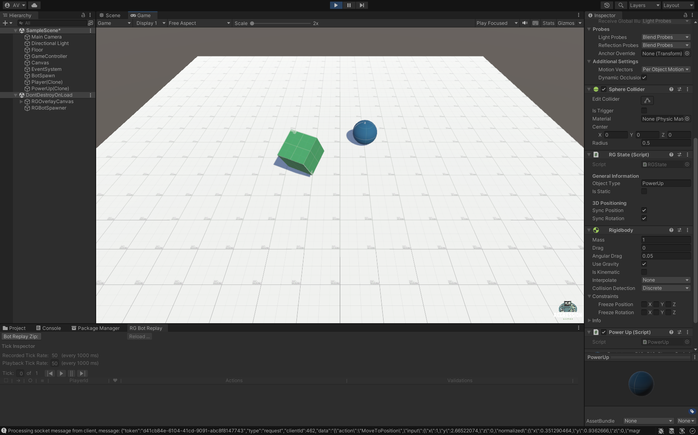

# RGSample

_This is the **completed** sample. See the **starter** branch for the beginning of the [tutorial](https://regression-games.github.io/RegressionDocs/studios/unity/tutorials/first_tutorial)._

```
git checkout -b starter
```

This is a demo scene to be used in trying out Regression Games. It features a player (the green block)
which collects power ups (the blue ball).



